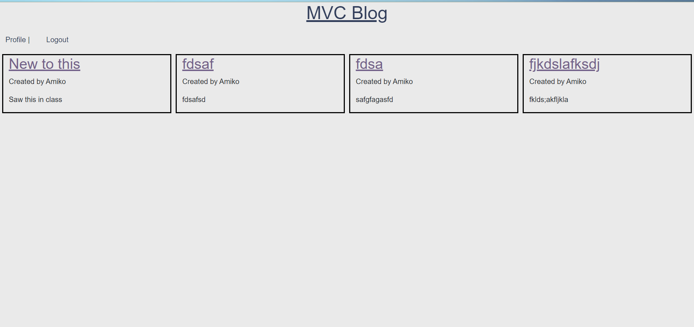
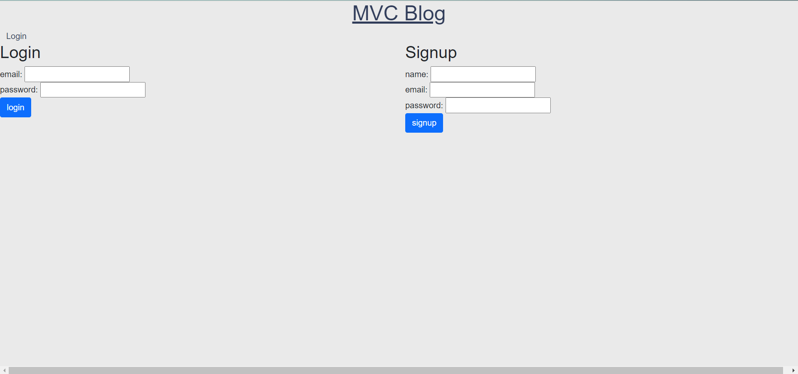
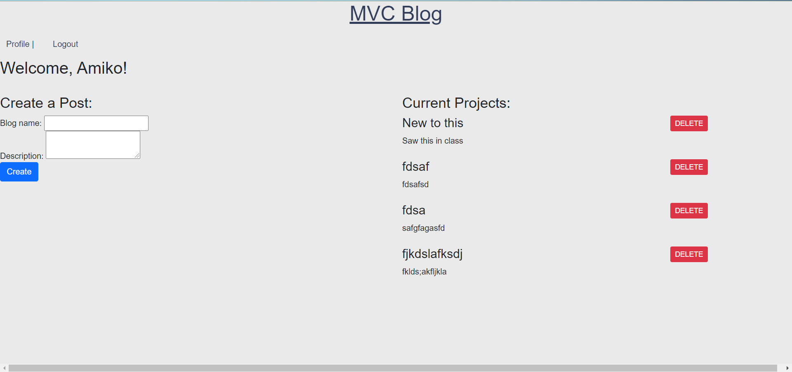

# Tech Blog

## Table of Content
[1 - Description](##Description) 
[2 - Installation Instructions](##Installation-Instructions) 
[3 - Usage](##Usage) 
[4 - Tools](##Tools) 
[5 - Contact](##Contact) 

## Description

Tech blog for users to post comments about learned tech skills.  Comments can be deleted and added.    

## Installation Instructions
None installation needed.  Click on link to deploy page

## Usage

1. Once page is deployed, explore as desired.  
2. 
3. 
4. 

## Tools

Express.js
Bootstrap

## Contact

Creator: Elizabeth De Santis
URL: https://gwu-tech-blog.herokuapp.com/
